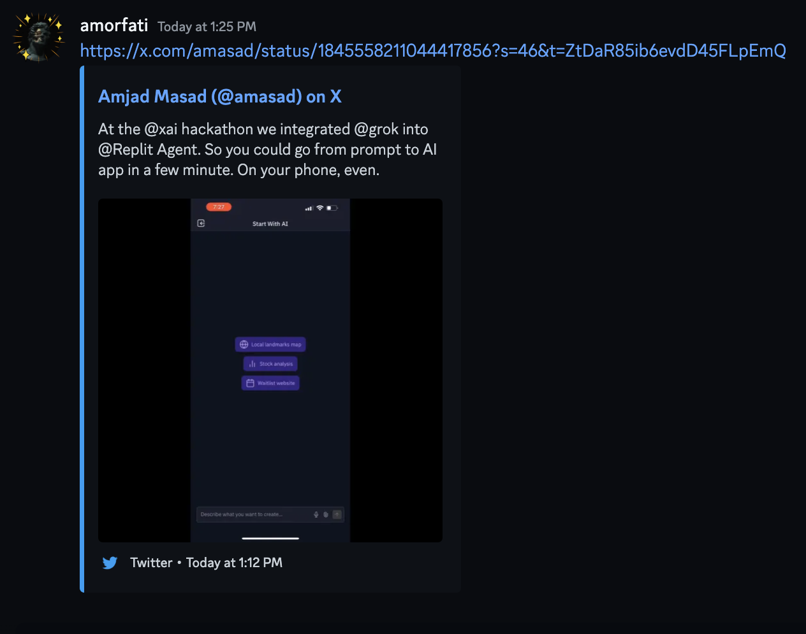

# autofx

Automatically fix broken Twitter/X, Reddit, TikTok, and Instagram embeds. Bonus: automatically remove trackers from urls

Links from x.com, reddit.com and similar sites are not good for sharing. They have tracking ids attached to them and they don't render well on messaging platforms like discord, iMessage, telegram.

Example a link for a post on x:

https://x.com/amasad/status/1845558211044417856?s=46&t=ZtDaR85ib6evdD45FLpEmQ

the `t=ZtDaR85ib6evdD45FLpEmQ` part is for tracking. I don't want that in my chats and servers (even though it's just for marketing - I'm against trackers principally)

this is how the post looks like when shared on discord. The post on x is a video, on discord only a static image is rendered



this is how the same post but with link cleaned from trackers and using fxtwitter


**fx** solutions used in this:

X/Twitter https://github.com/FixTweet/FxTwitter

Reddit https://github.com/MinnDevelopment/fxreddit

TikTok https://github.com/okdargy/fxTikTok

Instagram https://github.com/Wikidepia/InstaFix

---

```sh
TODO: finish README.md
```
